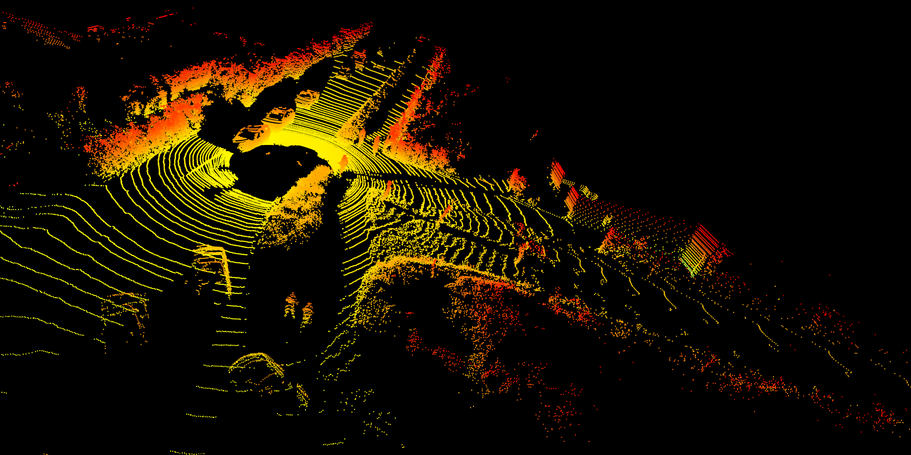

# Autonomous-Driving-Principles

In this section we will be reviweing unsupervised methods using [Open3D](https://www.open3d.org/docs/release/tutorial/geometry/pointcloud.html) see jupyter notebook for further details.

## KeyPoints

### 1-Plane Segmentation

### 2-DBSCAN Clustering

### 3-Voxel Downsampling

