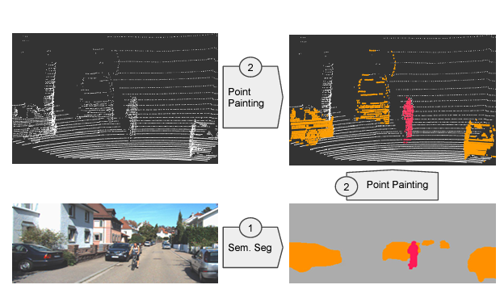
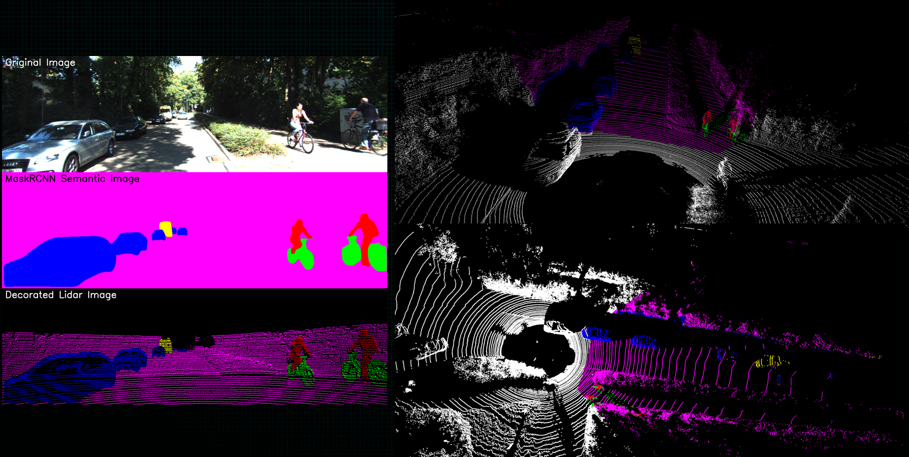

# Part I: Projection of LiDAR Data from 3D to 2D Pixel Space 

In this first section, we delve into the process of projecting LiDAR data from a three-dimensional space into a two-dimensional pixel space. We will explore a range of techniques rooted in linear algebra and computer graphics to effectively achieve this transformation. This tutorial will encompass the understanding of essential concepts and the application of various computational methods to bridge the gap between 3D LiDAR data and 2D imagery. Feel free to click on the gif below. 

# Part II: Data Fusion Application Via PointPainting

In this second section, we apply a similar concept to that in [PointPainting: Sequential Fusion for 3D Object Detection](https://arxiv.org/abs/1911.10150). Like the paper, I pass an image through a segmentation algorithm. Here, `maskrcnn_resnet50_fpn_v2` from PyTorch trained on the COCO dataset is used to obtain our segmentation mask and labels. These outputs are then utilized to decorate the point cloud, assigning a class to each point within the camera's frustum. All technical aspects of this section are complete, with documentation for the Jupyter notebook and helper Python functions and classes underway. Meanwhile, check out the results below for a glimpse of what to expect. Note: We focus solely on the data fusion aspect and not on the 3D object detection head using PointPillars, which might be a topic for future exploration.

### Point Painting Approach

### My Implementation Results

#### Semantic Map and Enhanced LiDAR Point Clouds in 2D Visualization

#### Comprehensive 3D Point Cloud Enhancement Using Semantic Mapping

