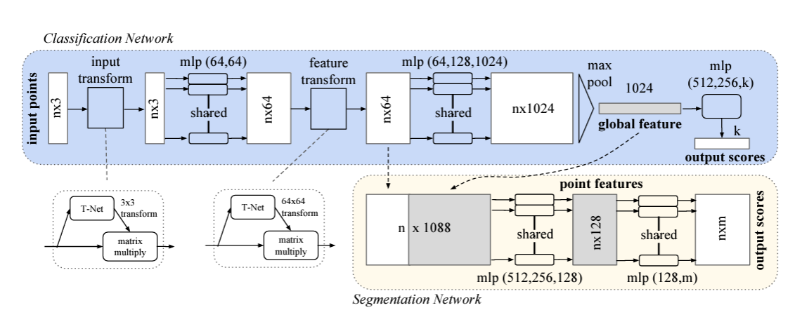
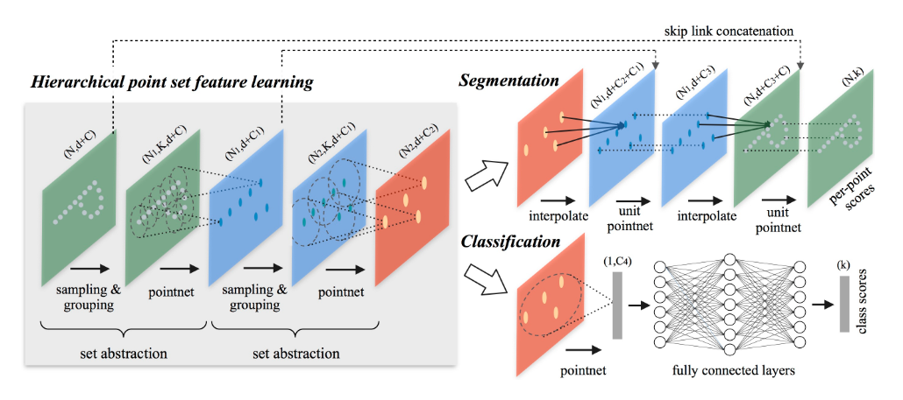
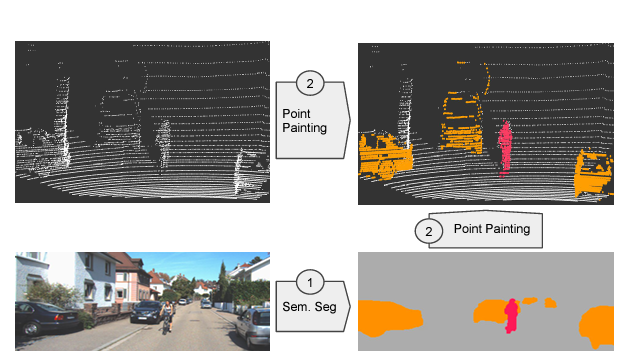

# Autonomous-Driving-Principles

## Coming Soon
In this repository, I provide a comprehensive tutorial on the essentials of 3D object detection, a critical component in the realms of autonomous driving and robotics. The tutorial begins with an introduction to an unsupervised learning method to establish the foundational concepts. Following this, I will explore two key supervised deep learning models: PointNet and PointNet++. I will demonstrate how to develop and train these models using PyTorch, focusing on classification tasks within 3D point cloud data. This is particularly pertinent for applications in autonomous vehicles and robotics. The tutorial will also include a segment on advanced data fusion techniques. Here, I will show how to merge LiDAR data with imagery, using calibration methods on the KITTI dataset. This will be complemented with practical examples, illustrating a technique similar to PointPainting for using a semantic image map to decorate a point cloud, providing valuable insights for those interested in autonomous driving and robotics.

### UPDATE 01/08/2024

I am currently working with the raw Kitty dataset, which has been uploaded to this repository. I have converted the dataset's point cloud data from `.bin` format to `.pcd` to ensure compatibility with Open3D. This data is located in the `DATA` folder of the repository. 

If you're interested in accessing the original, unprocessed version of the dataset, it can be downloaded from the link provided below. I'll be continuing to work on this and will provide more updates soon.

[Data Category: Residential, 2011_09_26_drive_0020 (0.4 GB)](https://www.cvlibs.net/datasets/kitti/raw_data.php?type=residential)

## Overview

### PointNet

### PointNet++ 

### PointPainting

## References
[PointNet: Deep Learning on Point Sets for 3D Classification and Segmentation](https://arxiv.org/abs/1612.00593)

[PointNet++: Deep Hierarchical Feature Learning on Point Sets in a Metric Space](https://arxiv.org/abs/1706.02413)

[PointPainting: Sequential Fusion for 3D Object Detection](https://arxiv.org/abs/1911.10150)

